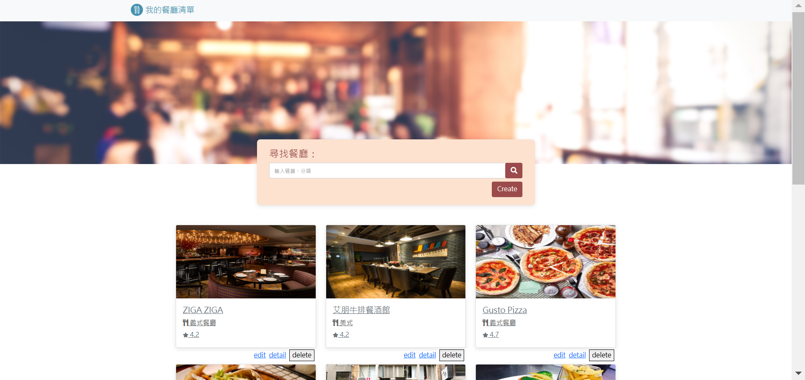
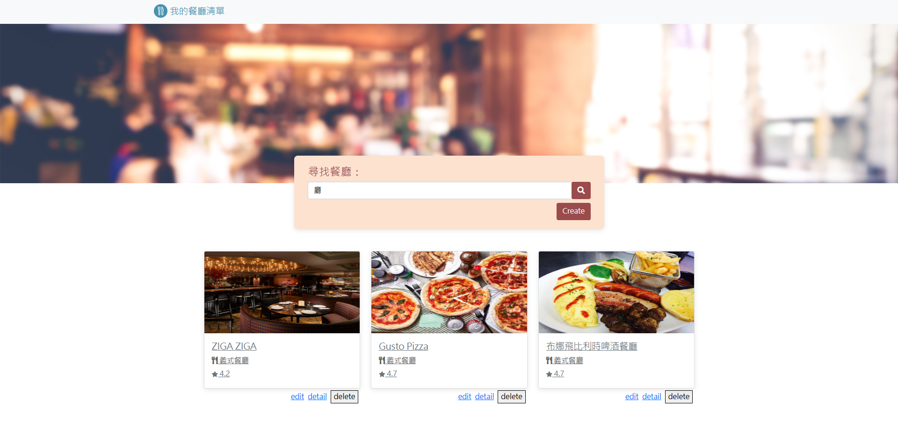

# 我的餐廳清單

## 簡介

這是一個簡易的紀錄美食餐廳的網站，資訊內容包含餐廳名稱、餐廳類型、餐廳地址等等。

## 功能

- 使用者可以瀏覽特定餐廳資訊
- 使用者可以使用搜尋功能
輸入餐廳名稱或是餐廳類型作為關鍵字，就能找到特定餐廳的資訊。
- 使用者可以新建餐廳資訊
新建資訊時，餐廳名稱是必填欄位，其他資訊欄位為可選。
- 使用者可以刪除特定餐廳資訊
- 使用者可以修改特定餐廳資訊

## 網站畫面

- 首頁

- 詳細頁

- 搜尋結果頁

- 修改資訊頁

- 新增資訊頁

## 開發工具

- Node.js 18.12.1
- Express 4.18.2
- Express-Handlebars 6.0.7
- dotenv 16.0.3
- mongoose 6.9.2
- Bootstrap 5.0.2
- Font-awesome 5.8.1

## 如何安裝使用

1. 請先確保本地端有安裝Node.js及npm。
2. 將本專案下載至本地存放。
3. 請使用終端機，並移至存放本專案的位置。

> cd 存放本專案的位置

4. 輸入以下內容，安裝與本專案相關的套件：

> npm install

5. 待上一步安裝完成後，再輸入：

> npm run start

6. 待上一步完成後，終端機會提示如下，請將後方網址複製到瀏覽器上進行瀏覽。

> This server is running on <http://localhost:3000>

7. 如果想暫停使用，請在終端機輸入ctrl^c，並關閉瀏覽器即可。
