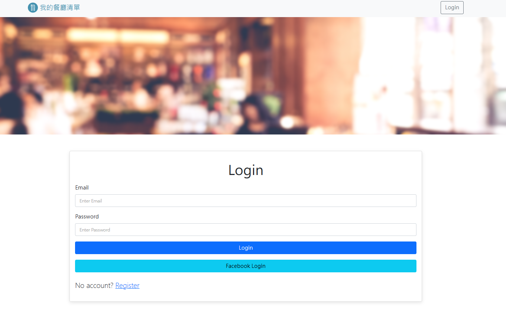

# 我的餐廳清單

## 簡介

這是一個簡易的紀錄美味餐廳的網站，使用者可以使用email或facebook帳號註冊登入，並編輯屬於自己的餐廳清單，可定義的餐廳資訊包含中英文名稱、餐廳類型、餐廳地址等等。

## 功能

- 使用者可以註冊帳號來編輯一份屬於自己的餐廳清單：登入與登出以及註冊過程中的錯誤或警告都有給予使用者提示。以下功能皆須登入後才能使用。
- 使用者可以瀏覽特定餐廳資訊。
- 使用者可以使用搜尋功能：輸入餐廳名稱或是餐廳類型作為關鍵字，就能找到特定餐廳的資訊。
- 使用者可以新建餐廳資訊：新建資訊時，餐廳名稱是必填欄位，其他資訊欄位為可選。
- 使用者可以刪除特定餐廳資訊。
- 使用者可以修改特定餐廳資訊。
- 使用者可以使用排序功能：提供排序的選項有 A > Z、Z > A、類別、地區、評分 (高 > 低)，搜尋後也能使用排序功能。

## 網站畫面

- 首頁/登入頁

- 詳細頁

- 搜尋結果頁

- 修改資訊頁

- 新增資訊頁

- 搜尋&排序

- 註冊頁

## 開發工具

- 請參考文件：package.json

## 如何安裝使用

1. 請先確保本地端有安裝Node.js及npm。
2. 將本專案下載至本地存放。
3. 請使用終端機，並移至存放本專案的位置。

> cd 存放本專案的位置

4. 輸入以下內容，安裝與本專案相關的套件：

> npm install

5. 待上一步安裝完成後，再輸入：

> npm run start

6. 待上一步完成後，終端機會提示如下，請將後方網址複製到瀏覽器上進行瀏覽。

> This server is running on <http://localhost:3000>

7. 如果想暫停使用，請在終端機輸入ctrl^c，並關閉瀏覽器即可。

8. 如有需要生成種子資料，請輸入：

> npm run seed

- 該種子資料會生成兩位使用者，且這兩位使用者分別擁有三組餐廳資料。測試帳號如下：
(1) 測試帳號一
email: user1@example.com
password: 12345678
(2) 測試帳號二
email: user2@example.com
password: 12345678
